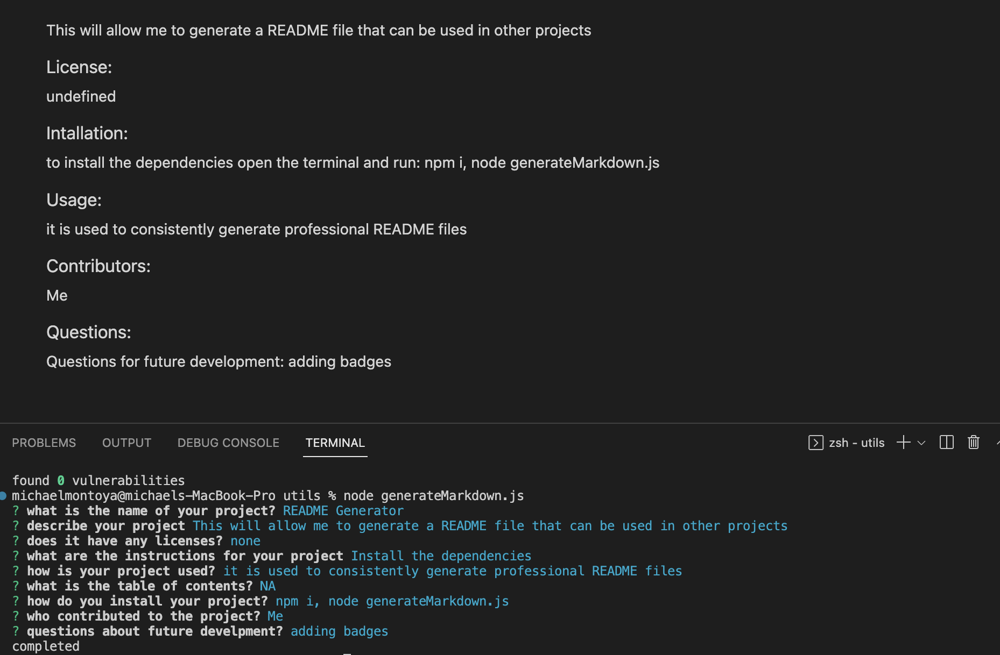

# README Generator
This will allow me to generate a README file that can be used in other projects
### License:
undefined
### Intallation:
to install the dependencies open the terminal and run:
npm i, node generateMarkdown.js
### Usage:
it is used to consistently generate professional README files
 ### Links
 [video](https://drive.google.com/file/d/1Dk7OCaOTQXfphztWkKU5a9CZHzM9s-Lm/view)

 [github](https://github.com/mmontoya1112/READMEgenerator)
 ### Screenshot

